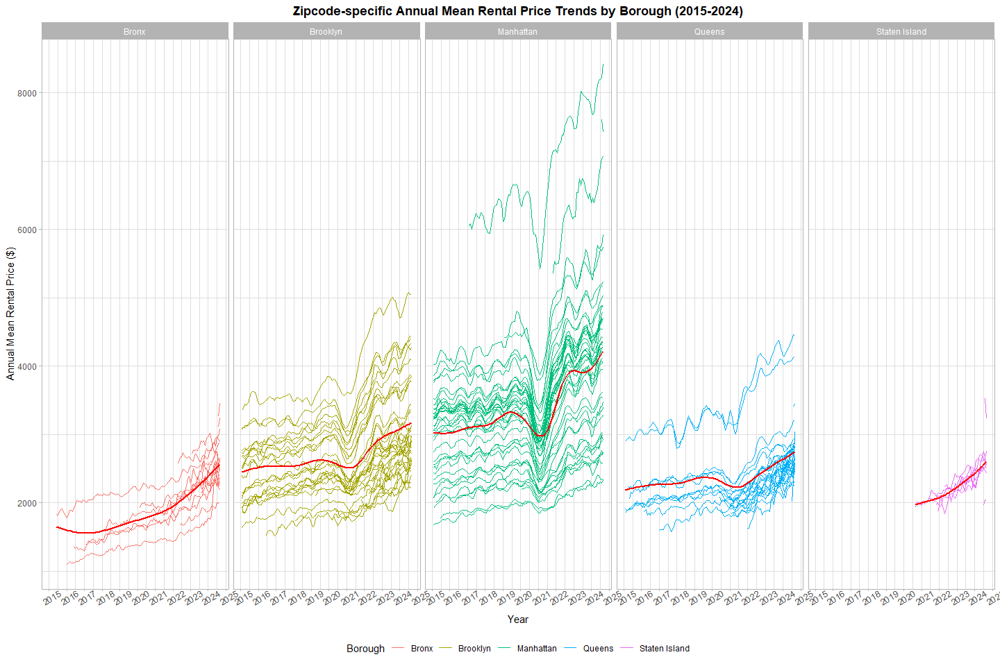
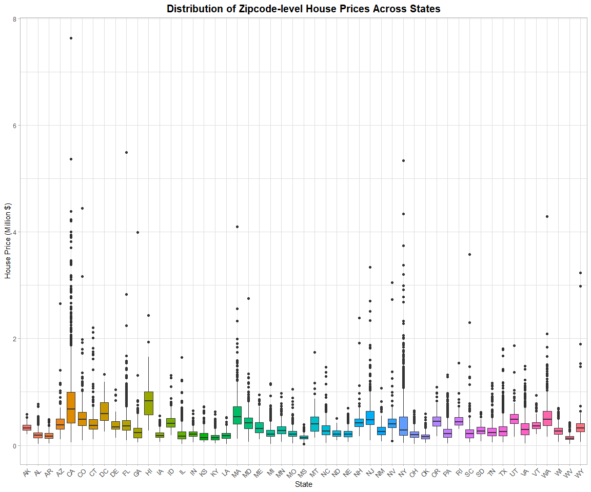
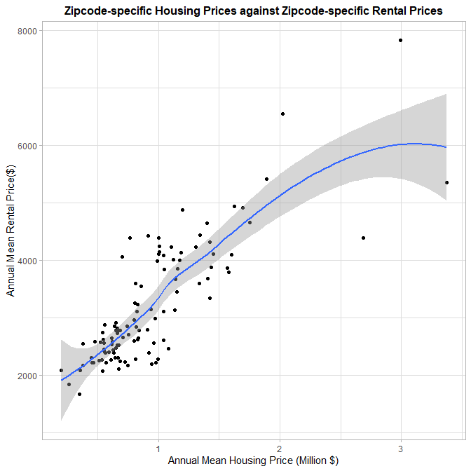

Data Science I, Midterm Project
================

<style>
table {
  font-size: 12px;
  border-collapse: collapse;
  margin: 0 auto;
}
&#10;th, td {
  padding: 3px 7px;
  text-align: center;
}
&#10;table, th, td {
  border: 1px solid #ddd;
}
</style>

##### **Load Packages & Raw Data Discussion**

``` r
# Load Necessary Packages
  library(ggplot2)
  library(tidyverse)
  library(dplyr)
  library(tidyr)
  library(rvest)

# Preliminary Loading of All Datasets
  NYC_Rental_Price = read.csv("./NYC Rental.csv")
  US_Housing_Price = read.csv("./US Housing 2023.csv")
  NYC_Zipcode      = rvest::read_html("https://p8105.com/data/zip_codes.html") %>% html_table(fill = TRUE) %>% mutate(.=.[[1]])
```

###### Discussion

- Raw Data
  - `NYC_Zipcode`
    - Dimension: 322 x 8  
    - Description: The `NYC_Zipcode` Dataset contains data of
      Zipcode-Location associations within entire NYC.  
  - `NYC_Rental_Price`
    - Dimension: 149 x 125  
    - Description: The `NYC_Rental_Price` Dataset contains rental price
      data within NYC from year 2015 to 2018.  
  - `US_Housing_Price`
    - Dimension: 26338 x 21  
    - Description: The `US_Housing_Price` Dataset contains housing price
      data within entire U.S. in year 2023.  
- Goal
  - Clean, Analyze, Interpret, Visualize using NYC_Rental and US_Housing
    datasets

##### **Data Cleaning**

``` r
# Raw-Data -> Pivot Longer -> Filter out Redundant Columns
  NYC_Rental_Price = NYC_Rental_Price %>% 
                     select(RegionName, CountyName, starts_with("X")) %>% 
                     janitor::clean_names() %>% 
                     rename("zipcode"="region_name", "county"="county_name") %>% 
                     mutate(county=gsub(" County","",county)) %>% 
                     mutate(across(where(is.numeric), round, 2)) %>% 
                     pivot_longer(cols=starts_with("x"), names_to="date", values_to="rental_price") %>% 
                     mutate(date=gsub("x","",date)) %>% 
                     mutate(date=gsub("_","/",date))
  
  NYC_Zipcode = NYC_Zipcode %>% 
                janitor::clean_names() %>% 
                select(county, zip_code, neighborhood) %>% 
                rename("zipcode"="zip_code") %>% 
                mutate(borough=recode(county, "Kings"="Brooklyn", "New York"="Manhattan", "Richmond"="Staten Island")) %>% 
                relocate(zipcode, county, borough)

  US_Housing_Price = US_Housing_Price %>% 
                     janitor::clean_names() %>% 
                     select(city, region_name, state, starts_with("x")) %>% 
                     rename("zipcode"="region_name") %>% 
                     arrange(zipcode) %>%
                     pivot_longer(cols=starts_with("x"), names_to="date", values_to="housing_price") %>% 
                     mutate(date=gsub("x","",date)) %>% 
                     mutate(date=gsub("_","/",date)) %>% 
                     relocate(zipcode)

# Rectify incorrect zipcodes
  NYC_Zipcode %>% filter(zipcode==11201 | zipcode==10463) %>% select(zipcode, county, borough) # correct data should be: 11201--Kings--Brooklyn & 10463--Bronx--Bronx
```

    ## # A tibble: 4 × 3
    ##   zipcode county   borough  
    ##     <int> <chr>    <chr>    
    ## 1   10463 Bronx    Bronx    
    ## 2   11201 Kings    Brooklyn 
    ## 3   10463 New York Manhattan
    ## 4   11201 New York Manhattan

``` r
  NYC_Zipcode = NYC_Zipcode %>% filter(!(zipcode==11201 & county=="New York")) %>% filter(!(zipcode==10463 & county=="New York")) # select all correct zipcodes

# Create Merged Dataset
  Merged = left_join(x=NYC_Zipcode, y=NYC_Rental_Price, by="zipcode") %>%
           rename("county"="county.x") %>% 
           relocate(zipcode, county, borough, neighborhood) %>% 
           select(-county.y)
```

###### Problem1 Discussion

- When merging datasets, warning message appears: Detected an unexpected
  many-to-many relationship between x and y variables, implying
  “zipcode” is not unique in `NYC_Zipcode` dataset.  
- Upon checking, zipcode all unique in `NYC_Rental_Price` and
  `NYC_Housing Price`, but contain duplicate values 10463 and 11201 in
  `NYC_Zipcode`. Remove incorrect records.  
- Upon removal of incorrect observations, the join was performed
  successfully with the resulting `Merged` dataset.
- Description on the `Merged` dataset:
  - Dimension: 17455 x 6.  
  - Unique Zipcodes Included: 320  
  - Unique Neighborhood Include: 43  
- Data Manipulation
  - In both `NYC_Rental_Price` and `US_Housing_Price` datasets, changed
    `RegionName` to `zipcode`.  
  - Converted `NYC_Rental_Price` and `NYC_Rental_Price` to a longer
    format with all date variables listed under column `date` and values
    listed under column `rental_price` and `housing_price`,
    respectively.  
  - Redundant Column Names
    - In `NYC_Zipcode` dataset, I kept only the `zipcode`, `county`,
      `borough`, `neighborhood` columns.  
    - In `NYC_Rental_Price` dataset, I kept only the `zipcode`,
      `county`, `date`, `rental_price` columns.  
    - In `US_Housing_Price` dataset, I kept only the `zipcode`, `city`,
      `state`, `housing_price` columns.

##### **Tables**

``` r
# Table 1 --- average rental price in each borough and year
  Table1 = Merged %>% 
           separate(date, into=c("year","month","day"), sep="/") %>% 
           group_by(borough, year) %>% 
           summarise(mean_rental_price=mean(rental_price, na.rm=TRUE)) %>% 
           pivot_wider(names_from=borough, values_from=mean_rental_price) %>% 
           filter(!is.na(year))

# Table 2 --- comparing average rental prices from 2020 to 2021
  Table2 = Merged %>% 
           separate(date, into=c("year","month","day"), sep="/") %>% 
           filter( (year=="2020"|year=="2021") & month==c("1") ) %>% 
           group_by(year) %>% 
           select(zipcode, year, rental_price) %>% 
           rename("January_of_Year"="year") %>% 
           pivot_wider(names_from=January_of_Year, values_from=rental_price) %>% 
           rename("Jan.2020"="2020", "Jan.2021"="2021") %>% 
           arrange(zipcode) %>% 
           mutate(absolute_change = Jan.2021-Jan.2020, relative_percentage_change = (Jan.2021 - Jan.2020) / Jan.2020 * 100) %>% 
           mutate(across(where(is.numeric),round, 2))

# Table 3 --- for each borough, select neighborhood with largest drop in rental price from Jan.2020 to Jan.2021 
  Table3 =  Merged %>% 
            separate(date, into=c("year","month","day"), sep="/") %>% 
            filter((year %in% c("2020", "2021")) & (month=="1")) %>%
            pivot_wider(names_from = year, values_from = rental_price, names_prefix = "Jan.") %>%
            mutate(drop = Jan.2020 - Jan.2021) %>% 
            filter(!is.na(drop)) %>% 
            group_by(borough) %>%
            arrange(borough, desc(drop)) %>%
            slice(1) %>%
            select(-zipcode, -month, -day, -county)

# Table 4 --- average house price within each ZIP code over 2023
  Table4 = US_Housing_Price %>% 
           separate(date, into=c("year","month","day"), sep="/") %>% 
           group_by(zipcode, year) %>% 
           summarise(mean_housing_price=mean(housing_price)) %>% 
           mutate(year=as.numeric(year), mean_housing_price=round(mean_housing_price,digits=0)) %>% 
           select(-year)
```

###### Problem2 Discussion

- Month Discrepancy
  - Some months do not have meaningful research values for collection.
  - Decided not to include some Months as the rental prices data are too
    incomplete within this period.  
- Zipcode Discrepancy
  - `NYC_Rental_Price` dataset has 149 but `NYC_Zipcode` dataset has 320
    zipcodes is because it is not necessary to include rental price data
    for every single zipcode within NYC.  
- Tabe:

| year |    Bronx | Brooklyn | Manhattan |   Queens | Staten Island |
|:-----|---------:|---------:|----------:|---------:|--------------:|
| 2015 | 1759.596 | 2492.928 |  3022.042 | 2214.707 |           NaN |
| 2016 | 1520.195 | 2520.357 |  3038.818 | 2271.955 |           NaN |
| 2017 | 1543.599 | 2545.828 |  3133.848 | 2263.303 |           NaN |
| 2018 | 1639.429 | 2547.291 |  3183.703 | 2291.918 |           NaN |
| 2019 | 1705.589 | 2630.503 |  3310.409 | 2387.816 |           NaN |
| 2020 | 1811.443 | 2555.051 |  3106.518 | 2315.632 |      1977.608 |
| 2021 | 1857.776 | 2549.890 |  3136.632 | 2210.787 |      2045.430 |
| 2022 | 2054.267 | 2868.199 |  3778.375 | 2406.038 |      2147.436 |
| 2023 | 2285.459 | 3015.183 |  3932.610 | 2561.615 |      2332.934 |
| 2024 | 2496.896 | 3125.657 |  4078.440 | 2693.584 |      2536.443 |

- Remarks on Table1
  - Across most boroughs, rental prices has a general increasing trend
    over year 2015-2024.  
  - Manhattan has the highest rental prices among all boroughs, with
    prices rising from 3022.04 in 2015 to 4078.44 in 2024.  
  - For Staten Island, the data is missing from 2015 to 2019. From 2020
    onward, values are recorded.  
  - Price variation between boroughs is significant: Manhattan
    consistenty has the highest rental prices while the Staten Island
    has the lowest prices(for available years).  
- The following is a selection of Table2 giving a comparison of rental
  prices in Jan.2021 to rental prices in Jan.2020:

| zipcode | Jan.2020 | Jan.2021 | absolute_change | relative_percentage_change |
|--------:|---------:|---------:|----------------:|---------------------------:|
|   10001 |  4108.10 |  3397.65 |         -710.45 |                     -17.29 |
|   10002 |  3645.42 |  2935.11 |         -710.31 |                     -19.48 |
|   10003 |  3569.78 |  2897.24 |         -672.54 |                     -18.84 |
|   10004 |  3149.66 |  2443.70 |         -705.96 |                     -22.41 |
|   10005 |  3407.59 |  2917.90 |         -489.69 |                     -14.37 |
|   10006 |       NA |  2956.05 |              NA |                         NA |
|   10007 |  6334.21 |  5421.61 |         -912.60 |                     -14.41 |
|   10009 |  3406.44 |  2692.19 |         -714.25 |                     -20.97 |
|   10010 |  3697.28 |  3012.35 |         -684.93 |                     -18.53 |
|   10011 |  4104.07 |  3441.91 |         -662.16 |                     -16.13 |
|   10012 |  3628.57 |  2942.34 |         -686.23 |                     -18.91 |
|   10013 |  4431.87 |  3797.82 |         -634.05 |                     -14.31 |
|   10014 |  3768.25 |  3188.49 |         -579.76 |                     -15.39 |
|   10016 |  3731.14 |  3019.43 |         -711.71 |                     -19.07 |
|   10017 |  3314.83 |  2793.41 |         -521.42 |                     -15.73 |
|   10018 |  3893.49 |  3314.23 |         -579.26 |                     -14.88 |
|   10019 |  3505.28 |  2970.02 |         -535.26 |                     -15.27 |
|   10021 |  3048.37 |  2564.91 |         -483.46 |                     -15.86 |
|   10022 |  3471.45 |  2852.83 |         -618.62 |                     -17.82 |
|   10023 |  3438.90 |  2895.11 |         -543.79 |                     -15.81 |

- Remarks on Table2
  - For most zipcodes, rental prices decreased from Jan.2020 to
    Jan.2021.  
- The following Table3 gives the largest drop in price from Jan.2020 to
  Jan.2021 with neighborhoods included:

| borough   | neighborhood        | Jan.2020 | Jan.2021 |   drop |
|:----------|:--------------------|---------:|---------:|-------:|
| Bronx     | Southeast Bronx     |  1922.05 |  1905.59 |  16.46 |
| Brooklyn  | Greenpoint          |  3425.76 |  2987.82 | 437.94 |
| Manhattan | Lower Manhattan     |  6334.21 |  5421.61 | 912.60 |
| Queens    | West Central Queens |  2509.86 |  2292.88 | 216.98 |

- Remarks on Table3
  - For all available boroughs and among those neighborhoods with the
    highest price drop from Jan.2020 to Jan.2021, `Lower Manhattan` has
    the largest price decrease of `$912.60` and `Southeast Bronx` has
    the least price decrease of `$16.46`.  
  - Rental prices in Bronx as a whole did not drop significantly between
    Jan.2020 to Jan.2021.  
  - Staten Island data in both Jan.2020 and Jan.2021 are unavailable for
    analysis.

##### **Plots**

###### Problem3 Discussion

``` r
  Plot1
```

<!-- -->

- Plot1 Remarks
  - Large Geographic Rental Disparities, with Manhattan having the
    highest rental prices while Bronx has relatively the lowest.  
  - General upward rental price trend across all boroughs especially in
    Manhattan and Brooklyn.  
  - Impact of COVID-19 is clear as there is a salient drop in rental
    prices across most boroughs in pandemic-severe time periods.  
  - Staten Island has lots of missing data.

``` r
  Plot2
```

<!-- -->

- Plot2 Remarks
  - CA has highest house prices with some zipcodes exceeding \$6 million
    whereas WV has the least.  
  - All states have median below \$1 million.
  - High Variability: CA, NY, CO; suggesting wider range of house
    prices  
    Low Variability: WV, AR, MS; suggesting more uniform house prices

``` r
  Plot3
```

<!-- -->

- Plot3 Remarks
  - General positive correlation between housing prices and rental
    prices by zipcode.
- Limitations:
  - Plentiful unavailable data for Staten Island.
