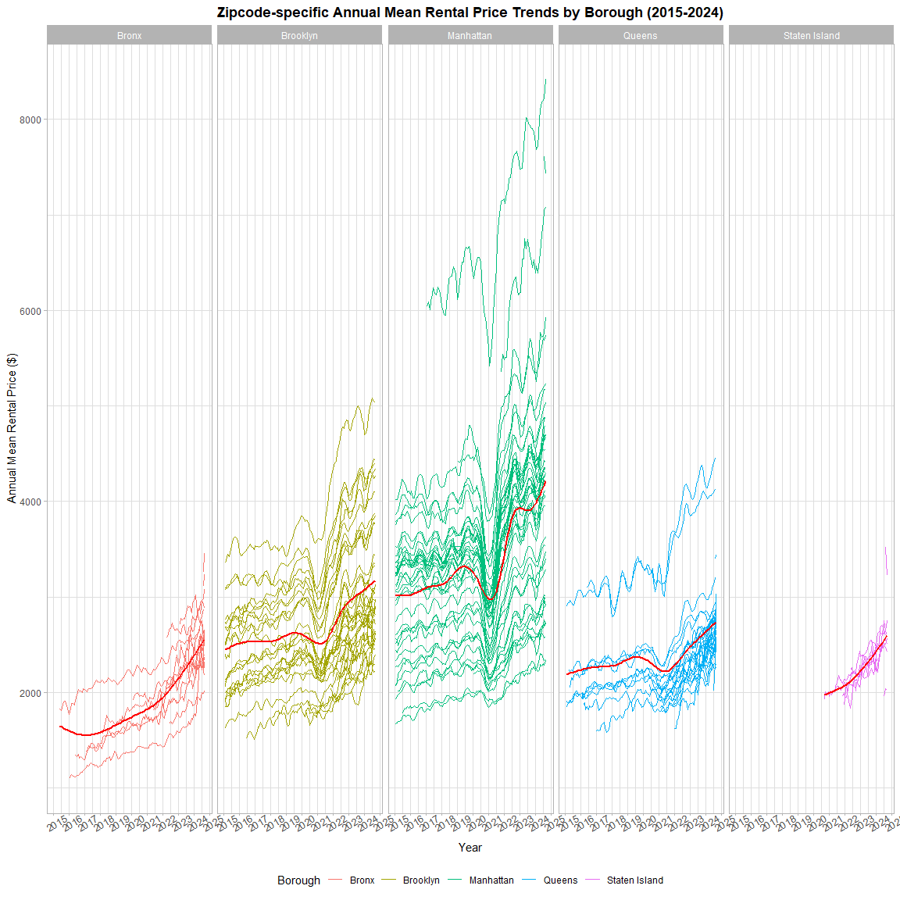
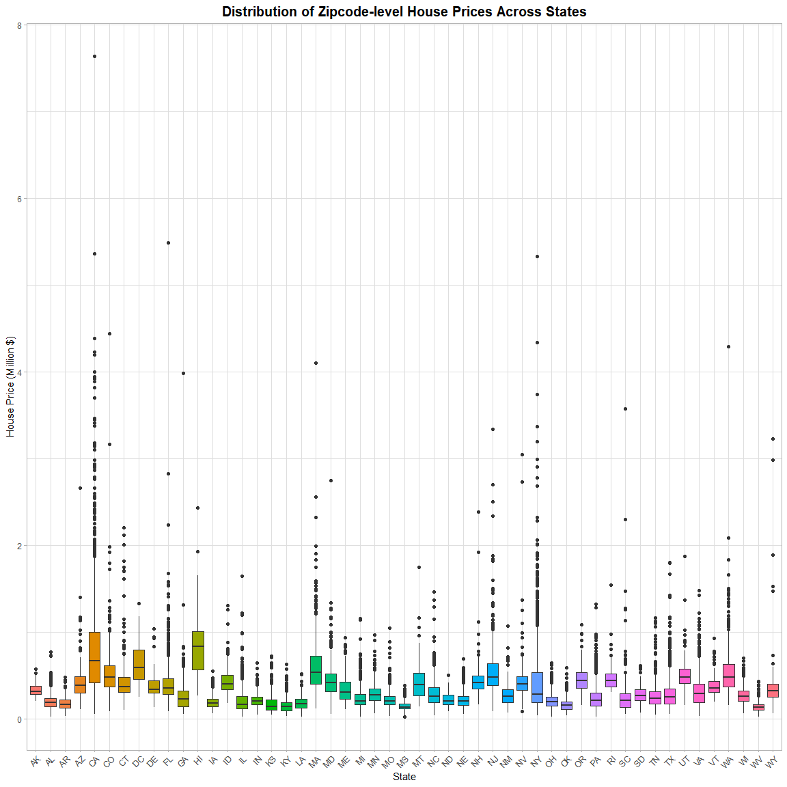
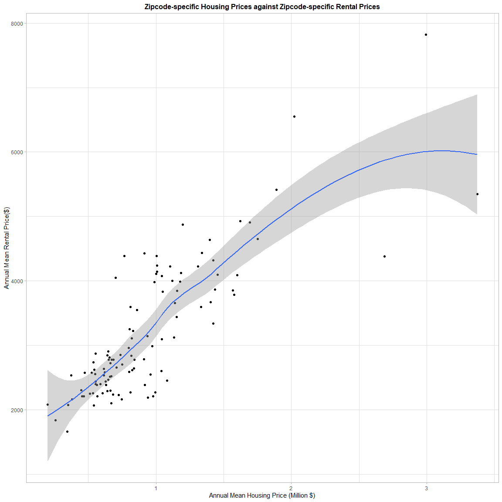

Data Science I, Midterm Project
================

##### Load Packages

``` r
# Load Necessary Packages
  library(ggplot2)
  library(tidyverse)
  library(dplyr)
  library(tidyr)
  library(patchwork)

# Preliminary Loading of All Datasets
  NYC_Rental_Price = read.csv("./NYC Rental.csv")
  NYC_Zipcode      = read.csv("./NYC Zipcode.csv")
  US_Housing_Price = read.csv("./US Housing 2023.csv")
```

##### Data Cleaning

``` r
# Raw-Data -> Pivot Longer -> Filter out Redundant Columns
  NYC_Rental_Price = NYC_Rental_Price %>% 
                     select(RegionName, CountyName, starts_with("X")) %>% 
                     janitor::clean_names() %>% 
                     rename("zipcode"="region_name", "county"="county_name") %>% 
                     mutate(county=gsub(" County","",county)) %>% 
                     mutate(across(where(is.numeric), round, 2)) %>% 
                     pivot_longer(cols=starts_with("x"), names_to="date", values_to="rental_price") %>% 
                     mutate(date=gsub("x","",date)) %>% 
                     mutate(date=gsub("_","/",date))
```

    ## Warning: There was 1 warning in `mutate()`.
    ## ℹ In argument: `across(where(is.numeric), round, 2)`.
    ## Caused by warning:
    ## ! The `...` argument of `across()` is deprecated as of dplyr 1.1.0.
    ## Supply arguments directly to `.fns` through an anonymous function instead.
    ## 
    ##   # Previously
    ##   across(a:b, mean, na.rm = TRUE)
    ## 
    ##   # Now
    ##   across(a:b, \(x) mean(x, na.rm = TRUE))

``` r
  NYC_Zipcode = NYC_Zipcode %>% 
                janitor::clean_names() %>% 
                select(county, zip_code, neighborhood) %>% 
                rename("zipcode"="zip_code") %>% 
                mutate(borough=recode(county, "Kings"="Brooklyn", "New York"="Manhattan", "Richmond"="Staten Island")) %>% 
                relocate(zipcode, county, borough)

  US_Housing_Price = US_Housing_Price %>% 
                     janitor::clean_names() %>% 
                     select(city, region_name, state, starts_with("x")) %>% 
                     rename("zipcode"="region_name") %>% 
                     arrange(zipcode) %>%
                     pivot_longer(cols=starts_with("x"), names_to="date", values_to="housing_price") %>% 
                     mutate(date=gsub("x","",date)) %>% 
                     mutate(date=gsub("_","/",date))

# Rectify incorrect zipcodes
  NYC_Rental_Price %>% group_by(zipcode) %>% filter(n() > 1) %>% distinct(zipcode)  # zipcodes all unique
```

    ## # A tibble: 149 × 1
    ## # Groups:   zipcode [149]
    ##    zipcode
    ##      <dbl>
    ##  1   11368
    ##  2   11385
    ##  3   11208
    ##  4   11236
    ##  5   10467
    ##  6   11373
    ##  7   11226
    ##  8   11207
    ##  9   10025
    ## 10   11214
    ## # ℹ 139 more rows

``` r
  US_Housing_Price %>% group_by(zipcode) %>% filter(n() > 1) %>% distinct(zipcode)  # zipcodes all unique
```

    ## # A tibble: 26,338 × 1
    ## # Groups:   zipcode [26,338]
    ##    zipcode
    ##      <int>
    ##  1    1001
    ##  2    1002
    ##  3    1005
    ##  4    1007
    ##  5    1008
    ##  6    1010
    ##  7    1011
    ##  8    1012
    ##  9    1013
    ## 10    1020
    ## # ℹ 26,328 more rows

``` r
  NYC_Zipcode %>% group_by(zipcode) %>% filter(n() > 1) %>% distinct(zipcode)       # zipcode 10463 and 11201
```

    ## # A tibble: 2 × 1
    ## # Groups:   zipcode [2]
    ##   zipcode
    ##     <int>
    ## 1   10463
    ## 2   11201

``` r
  NYC_Zipcode %>% filter(zipcode==11201 | zipcode==10463) %>% select(zipcode, county, borough) # correct data should be: 11201--Kings--Brooklyn & 10463--Bronx--Bronx
```

    ##   zipcode   county   borough
    ## 1   10463    Bronx     Bronx
    ## 2   11201    Kings  Brooklyn
    ## 3   10463 New York Manhattan
    ## 4   11201 New York Manhattan

``` r
  NYC_Zipcode = NYC_Zipcode %>% filter(!(zipcode==11201 & county=="New York")) %>% filter(!(zipcode==10463 & county=="New York")) # select all correct zipcodes

# Create Merged Dataset
  Merged = left_join(x=NYC_Zipcode, y=NYC_Rental_Price, by="zipcode") %>%
           rename("county"="county.x") %>% 
           relocate(zipcode, county, borough, neighborhood) %>% 
           select(-county.y)
```

##### Tables

``` r
# Table 1 --- average rental price in each borough and year
  Table1 = Merged %>% 
           separate(date, into=c("year","month","day"), sep="/") %>% 
           group_by(borough, year) %>% 
           summarise(mean_rental_price=mean(rental_price, na.rm=TRUE)) %>% 
           pivot_wider(names_from=borough, values_from=mean_rental_price) %>% 
           filter(!is.na(year))
```

    ## `summarise()` has grouped output by 'borough'. You can override using the
    ## `.groups` argument.

``` r
# Table 2 --- comparing average rental prices from 2020 to 2021
  Table2 = Merged %>% 
           separate(date, into=c("year","month","day"), sep="/") %>% 
           filter( (year=="2020"|year=="2021") & month==c("1") ) %>% 
           group_by(year) %>% 
           select(zipcode, year, rental_price) %>% 
           rename("January_of_Year"="year") %>% 
           pivot_wider(names_from=January_of_Year, values_from=rental_price) %>% 
           rename("Jan.2020"="2020", "Jan.2021"="2021") %>% 
           arrange(zipcode) %>% 
           mutate(absolute_change = Jan.2021-Jan.2020, relative_percentage_change = (Jan.2021 - Jan.2020) / Jan.2020 * 100) %>% 
           mutate(across(where(is.numeric),round, 2))

# Table 3 --- for each borough, select neighborhood with largest drop in rental price from Jan.2020 to Jan.2021 
  Table3 =  Merged %>% 
            separate(date, into=c("year","month","day"), sep="/") %>% 
            filter((year %in% c("2020", "2021")) & (month=="1")) %>%
            pivot_wider(names_from = year, values_from = rental_price, names_prefix = "Jan.") %>%
            mutate(drop = Jan.2020 - Jan.2021) %>% 
            filter(!is.na(drop)) %>% 
            group_by(borough) %>%
            arrange(borough, desc(drop)) %>%
            slice(1) %>%
            select(borough, neighborhood, drop)

# Table 4 --- average house price within each ZIP code over 2023
  Table4 = US_Housing_Price %>% 
           separate(date, into=c("year","month","day"), sep="/") %>% 
           group_by(zipcode, year) %>% 
           summarise(mean_housing_price=mean(housing_price)) %>% 
           mutate(year=as.numeric(year), mean_housing_price=round(mean_housing_price,digits=0)) %>% 
           select(-year)
```

    ## `summarise()` has grouped output by 'zipcode'. You can override using the
    ## `.groups` argument.

##### Plots

``` r
# Plot1 --- NYC Rental Prices within each zipcode for all available years facilitating comparisons across borough
  Plot1 = Merged %>% 
          mutate(date = as.Date(date, format = "%Y/%m/%d")) %>% 
          filter(!is.na(year)) %>% 
          separate(date, into=c("year","month","day"), sep="-", remove=FALSE) %>% 
          filter() %>% 
          group_by(date, borough, zipcode) %>% 
          filter(!is.na(rental_price)) %>% 
          ggplot(aes(x=date, y=rental_price, group=zipcode, color=borough, rm.na=TRUE)) +
          geom_line(se=FALSE, size=0.5) + 
          geom_smooth(aes(group=borough),color="red", se=FALSE)+
          facet_wrap(~borough, nrow=1, ncol=5) +
          scale_x_date(date_breaks = "1 year", date_labels = "%Y") +
          theme_light() +
          theme(axis.text.x=element_text(angle=45, hjust=0.5, size=10), plot.title=element_text(hjust=0.5), legend.position="bottom") +
          labs(title = "Zipcode-specific Annual Mean Rental Price Trends by Borough (2015-2024)", x = "Year", y = "Annual Mean Rental Price ($)", color = "Borough") +
          guides(fill=guide_legend(nrow=1))
  Plot1
```

    ## `geom_smooth()` using method = 'gam' and formula = 'y ~ s(x, bs = "cs")'

<!-- -->

``` r
# Plot2 --- distribution of Zipcode level house prices across states facilitating comparison of the distribution of house prices across states
  Plot2 = US_Housing_Price %>% 
          separate(date, into=c("year","month","day"), sep="/") %>% 
          group_by(zipcode, state) %>% 
          summarise(mean_housing_price=mean(housing_price, rm.na=TRUE)) %>% 
          ggplot(aes(x=state, y=mean_housing_price/ 1e6, fill=state)) + 
          geom_boxplot() + 
          labs(title = "Distribution of Zipcode-level House Prices Across States", x = "State", y = "House Price (Million $)") +
          theme_light() +     
          theme(plot.title = element_text(hjust = 0.5), legend.position = "bottom", legend.key.size = unit(0.5, "cm"), axis.text.x = element_text(angle = 45, hjust = 1)) + 
          guides(fill = guide_legend(ncol = 20))
```

    ## `summarise()` has grouped output by 'zipcode'. You can override using the
    ## `.groups` argument.

``` r
  Plot2
```

<!-- -->

``` r
# Plot3 --- Zipcode specific housing prices against Zipcode specific rental prices ( In NYC 2023 )
  Plot3 = inner_join(x=NYC_Rental_Price %>% separate(date, into=c("year","month","day"), sep="/") %>% filter(year==2023) %>% group_by(zipcode) %>% summarise(annual_mean_rental=mean(rental_price)), 
                     y=US_Housing_Price %>% separate(date, into=c("year","month","day")) %>% filter(city=="New York") %>% group_by(zipcode) %>% summarise(annual_mean_housing=mean(housing_price)), 
                     by="zipcode") %>% 
          ggplot(aes(x=annual_mean_housing/1e6, y=annual_mean_rental), rm.na=TRUE) + 
          geom_point() +
          geom_smooth() +
          labs(title="Zipcode-specific Housing Prices against Zipcode-specific Rental Prices", x="Annual Mean Housing Price (Million $)", y="Annual Mean Rental Price($)") +
          theme_light() + 
          theme(plot.title=element_text(hjust=0.5))
  Plot3
```

    ## `geom_smooth()` using method = 'loess' and formula = 'y ~ x'

<!-- -->
